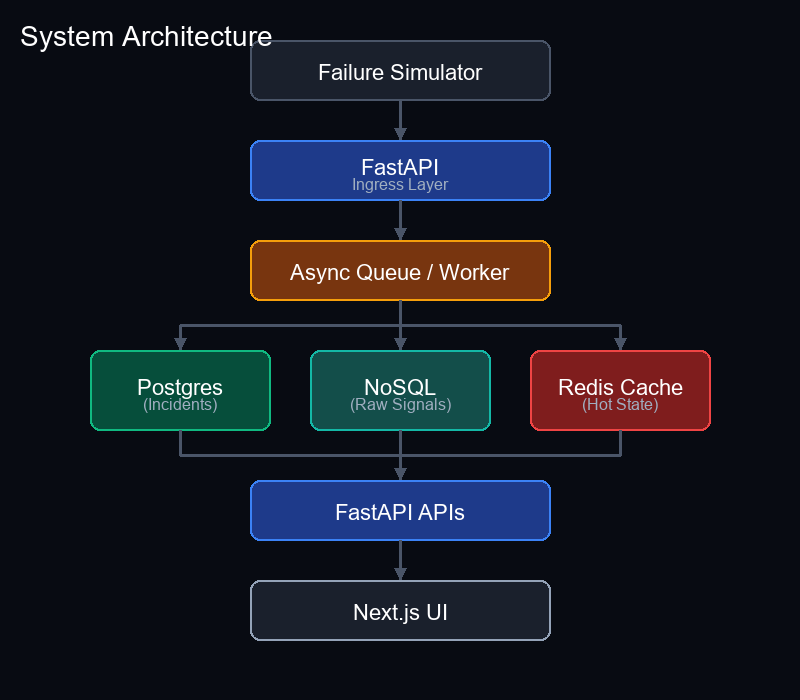
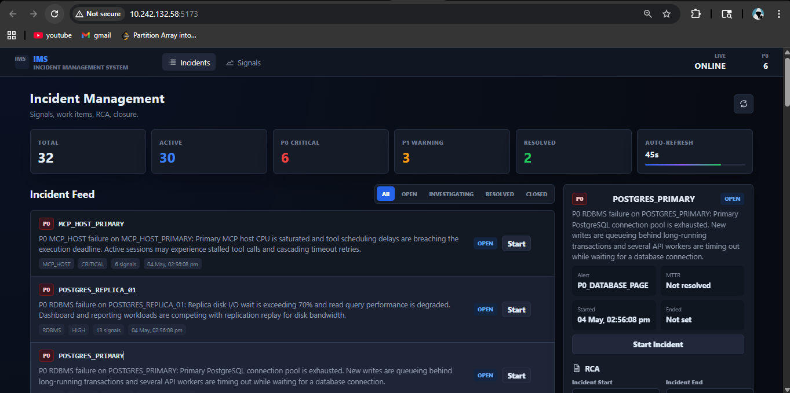
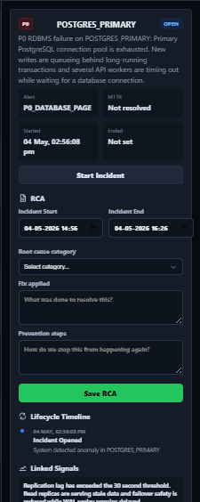
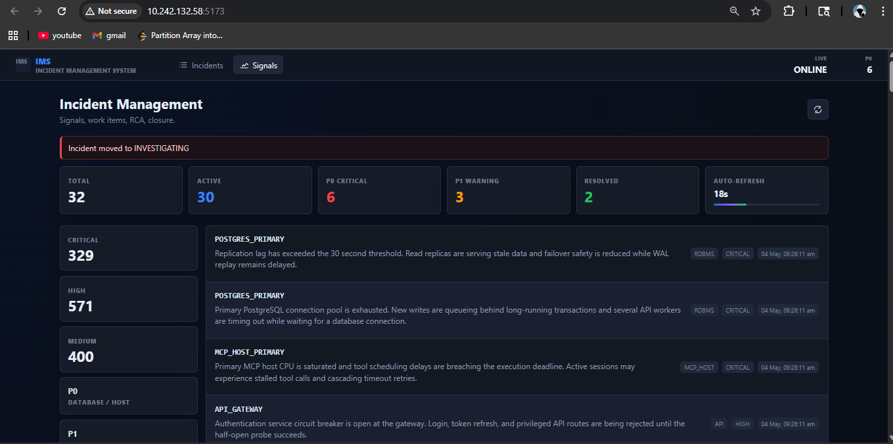

# IMS Incident Management System

A resilient Incident Management System for distributed stacks, built as a single repository with `/backend` and `/frontend`.

This repository is configured for local development without Docker.

## Overview

This project ingests high-volume failure signals, groups them into incidents, stores raw audit data, and drives a workflow for RCA and closure.

Key capabilities:
- Async signal ingestion with component-affinity sharding
- Debouncing to collapse noisy signal bursts into single incidents
- MongoDB raw signal audit log and PostgreSQL incident/SLA source of truth
- Redis for rate limiting, debounce windows, and hot cache state
- Incident lifecycle with RCA validation and MTTR tracking
- React dashboard with live incident feed, signal drilldown, and RCA form

## Architecture

```mermaid
flowchart LR
  subgraph Ingestion
    A[Producers / Simulators] -->|POST /api/v1/signals| B[FastAPI Ingestion API]
    A -->|POST /api/v1/signals/batch| B
  end

  B --> C[Redis Rate Limiter]
  B --> D[Signal Load Balancer]
  D -->|shard queues| E[Async Workers]
  E --> F[Debounce Service]
  F -->|incident id| G[PostgreSQL Incidents]
  E -->|raw audit| H[MongoDB raw_signals]
  E -->|dashboard update| I[Redis Hot Cache]

  G --> J[Incident Lifecycle / RCA]
  I --> K[Frontend Dashboard]
  H --> K
  J --> K

  end
```

### Workflow

1. **Signal ingestion**: producers push individual or batch failures into `/api/v1/signals`.
2. **Rate limiting**: Redis enforces global and per-IP quotas before queue acceptance.
3. **Load balancing**: component IDs are hashed to shard queues so related traffic stays on the same worker path.
4. **Debounce**: repeated signals from the same component within 10 seconds map to the same incident.
5. **Persistence**: every raw signal is persisted in MongoDB; incident metadata and RCA records live in PostgreSQL.
6. **Dashboard**: the frontend shows live incidents, raw signal drilldown, RCA submission, and status transition controls.

## System Diagram



## Repository Layout

- `/backend` - FastAPI service, database bootstrap, ingestion logic, worker queue, reducers
- `/frontend` - React + Vite dashboard UI
- `/scripts` - signal simulator and sample JSON payloads

## Setup Instructions

### Option 1: Local development

#### Start Redis

```powershell
redis-server
```

If Redis is not available, the backend will still start and continue running in degraded mode.

#### Backend

```powershell
cd backend
python -m venv .venv
.\.venv\Scripts\Activate.ps1
pip install -r requirements.txt
uvicorn app.main:app --reload --host 0.0.0.0 --port 8000
```

#### Frontend

```powershell
cd frontend
npm install
npm run dev -- --host 0.0.0.0 --port 5173
```

### Environment

Create `backend/.env` with values similar to:

```env
POSTGRES_DSN=
POSTGRES_HOST=localhost
POSTGRES_PORT=5432
POSTGRES_DB=ims_db
POSTGRES_USER=postgres
POSTGRES_PASSWORD=postgres
MONGO_URI=mongodb://localhost:27017
MONGO_DB=ims_raw
REDIS_URL=redis://localhost:6379/0
SIGNAL_QUEUE_MAXSIZE=50000
SIGNAL_WORKER_CONCURRENCY=20
DEBOUNCE_WINDOW_SECONDS=10
LOAD_BALANCER_SHARDS=4
RATE_LIMIT_GLOBAL=10000
RATE_LIMIT_PER_IP=1000
RATE_LIMIT_WINDOW_SECONDS=10
```

> Redis is optional for startup. If Redis is down, the backend continues in degraded mode with no rate limiting or debounce caching.

### Option 2: Docker Compose (Optional)

> **Note:** Docker was not working on the primary development machine, so this project is optimized for local development (Option 1). However, full Docker support is included. If you have Docker installed, you can use this option.

To start the entire stack (PostgreSQL, MongoDB, Redis, FastAPI Backend, and Vite Frontend) via Docker Compose:

```powershell
docker-compose up --build
```

Then access:
- **Backend API:** `http://localhost:8000`
- **Frontend UI:** `http://localhost:5173`

To run the simulation scripts against the Docker environment:
```powershell
# Open a new terminal
python -m venv .venv
.\.venv\Scripts\Activate.ps1
pip install requests
python scripts/simulate_failures.py --count 100 --rate 50 --batch
```

## Backpressure and Resilience

This system is built to avoid cascading failure when the persistence layer slows down.

### Backpressure strategy

- **Bounded in-memory queues**: a shard queue capacity is derived from `SIGNAL_QUEUE_MAXSIZE` and `LOAD_BALANCER_SHARDS`.
- **Queue rejection**: if a shard queue is full, ingestion returns `503 Service Unavailable` with a backpressure hint.
- **Rate limiting**: Redis enforces both total global signal ingestion and per-IP limits every `RATE_LIMIT_WINDOW_SECONDS`.
- **Component-affinity sharding**: same `component_id` consistently maps to the same worker shard, keeping related signals close while allowing unrelated traffic to proceed.
- **Debouncing**: 100 signals from the same component within 10 seconds create one incident while all raw signals are stored, preventing incident explosion.

### Observability

- `/health` and `/health/ready` provide live and readiness checks.
- `/metrics` exposes queue depth, shard utilization, rate limit values, and worker counts.
- Console logs now include throughput metrics such as `signals_per_sec` every 5 seconds.

## Running Sample Data

A sample payload file exists at `scripts/sample_signals.json`.

To simulate complex failure traffic:

```bash
python scripts/simulate_failures.py --count 100 --rate 50 --batch
```

To send the sample JSON manually via curl:

```bash
curl -X POST http://localhost:8000/api/v1/signals/batch \
  -H "Content-Type: application/json" \
  -d @scripts/sample_signals.json
```

This sample includes:
- PostgreSQL pool exhaustion and replication lag
- MCP host CPU saturation
- API latency and gateway errors
- Cache and NoSQL degradation
- Async queue backlog

## API Summary

### Ingestion
- `POST /api/v1/signals`
- `POST /api/v1/signals/batch`

### Raw signal and stats
- `GET /api/v1/signals`
- `GET /api/v1/signals?incident_id=<id>`
- `GET /api/v1/signals/stats/summary`
- `GET /api/v1/signals/{signal_id}`

### Incident lifecycle
- `GET /api/v1/incidents`
- `GET /api/v1/incidents/{incident_id}`
- `PATCH /api/v1/incidents/{incident_id}/status`

### RCA
- `POST /api/v1/rca/{incident_id}`
- `GET /api/v1/rca/{incident_id}`

## Frontend Screenshots

Add the application screenshots in `screenshots/` and reference them here.

- 
- 
- 

## Creative Additions

This implementation includes:
- real-time debounce grouping for noisy failure bursts
- priority-sorted incident feed
- async processing using worker queues and sharded load balancing
- a separate raw audit store with queryable MongoDB indexes
- a Redis-based hot cache for dashboard state and debounce window enforcement


